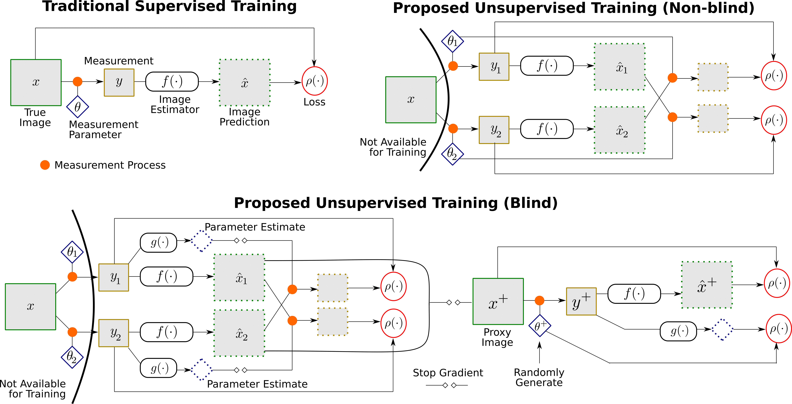

# Training Image Estimators without Image Ground-Truth

[Project](https://projects.ayanc.org/unsupimg/) | [Arxiv](https://arxiv.org/abs/1906.05775)

Copyright (C) 2019, Zhihao Xia and Ayan Chakrabarti

This distribution provides a Tensorflow implementation, along with trained models, for the method described in our NeurIPS 2019 paper:

[Zhihao Xia](https://likesum.github.io/) and [Ayan Chakrabarti](https://cse.wustl.edu/faculty/Pages/faculty.aspx?bio=117), "**[Training Image Estimators without Image Ground-Truth](https://arxiv.org/abs/1906.05775)**", NeurIPS 2019 (**spotlight**).

 

 

If you find the code useful for your research, we request that you cite the above paper. Please contact zhihao.xia@wustl.edu with any questions.

## 
We evaluate our method on two applications: compressive sensing and face deblurring. The code and pre-trained models for each application can be found in [compressive_sensing/](./compressive_sensing/) and [face_deblur/](./face_deblur/), respectively. 

## Prerequisites
- Linux or OSX
- NVIDIA GPU + CUDA CuDNN (CPU mode might work, but untested)
- Python3 & Tensorflow (the code has been tested for Tensorflow 1.7 and 1.14)